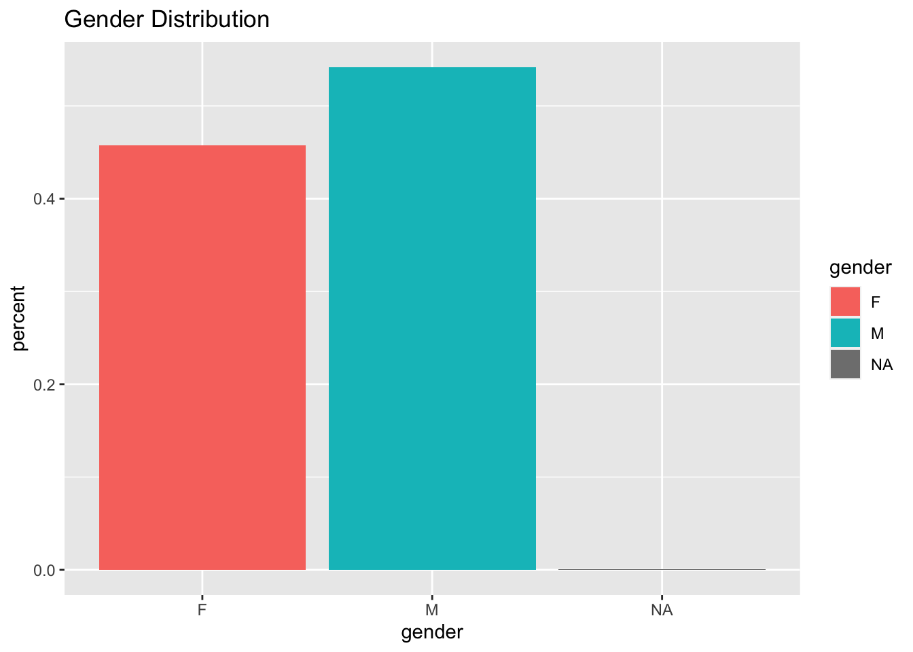

# Problem Definition 

In the Women in Data Science (WiDS) Datathon 2021, we will build a model to **determine whether a patient has been diagnosed with Diabetes Mellitus within the first 24 hours of being admitted to an Intensive Care Unit (ICU)**. To improve a patient's outcome in an ICU knowledge about their medical conditions can improve clinical decisions. However, often a patient's medical records are not immediately available due to transfer times. An additional challenge is when a patient is not able to provide such information due to their health condition, e.g. shock or unconsciousness. Therefore, it is important to be able to diagnose whether a patient has chronic diseases based on data that can be gathered within the first 24 hours of being admitted to an ICU.

# Diabetes Mellitus

According to the World Health Organization (WHO) Diabetes Mellitus, or commonly know as diabetes, is defined as follows:

> Diabetes is a chronic disease that occurs either when the pancreas **does not produce enough insulin or when the body cannot effectively use the insulin it produces**. Insulin is a hormone that regulates blood sugar. Hyperglycaemia, or **raised blood sugar**, is a common effect of uncontrolled diabetes and over time leads to serious damage to many of the body's systems, especially the nerves and blood vessels. - [WHO Diabetes Fact Sheet](https://www.who.int/news-room/fact-sheets/detail/diabetes)

There are two types of diabetes - **Type 1 diabetes and Type 2 diabetes**. Type 2 diabetes is more common than Type 1 diabetes and often results from excess body weight and physical inactivity while Type 1 diabetes is independent on body size. Additionally, there is **Gestational diabetes** in which a woman without diabetes develops high blood sugar levels during pregnancy. The latter usually resolves after birth while the other two types of diabetes have to be treated in the long-term.

Around 8.5% of the adult population is diagnosed with Diabetes independent of the gender (World Health Organization, 2020).

Diabetes mellitus is characterized by high blood sugar levels over a prolonged period of time and is diagnosed by demonstrating any one of the following:

- Fasting plasma glucose level ≥ 7.0 mmol/L (126 mg/dL)
- Plasma glucose ≥ 11.1 mmol/L (200 mg/dL) two hours after a 75 gram oral glucose load as in a glucose tolerance test
- Symptoms of high blood sugar and casual plasma glucose ≥ 11.1 mmol/L (200 mg/dL)
- Glycated hemoglobin (HbA1C) ≥ 48 mmol/mol (≥ 6.5 DCCT %)

# Data Overview
The data is provided by [MIT's GOSSIS (Global Open Source Severity of Illness Score)](https://gossis.mit.edu/) initiative. It contains:

- 179 features from 6 feature categories: identifier, demographic, APACHE co-variate, vitals, labs blood gas, APACHE co-morbidity
- 1 target *diabetes_mellitus*


### Question 1
What other information would we want to know about our data set?
*Answer here*

## Read in our data

You will need to install the `janitor` and `skimr` packages if you do not have them. 

```r
library(tidyverse)
library(readr) #for reading in data
library(janitor) #for tably function (similar to table function)
library(skimr) # for skim function (similar to summary function)
```


We need to read in our data. You can download the **TrainingWiDS2021** and **DataDictionaryWiDS2021** [here](https://www.kaggle.com/c/widsdatathon2021/data). If you keep it in your Downloads folder, you can use the following code chunk. If you keep this .Rmd file and the data sets in the same folder and set that as your working directory, you can just refer to the data by its name ie read_csv(*"TrainingWiDS2021.csv"*)


```r
training <- read_csv("~/Desktop/math4180/TrainingWiDS2021.csv")
dictionary <- read_csv("~/Desktop/math4180/DataDictionaryWiDS2021.csv")
```

## Skim our data
Let's take a look at the training data

```r
training %>% head()
```

```
## # A tibble: 6 x 181
##      X1 encounter_id hospital_id   age   bmi elective_surgery ethnicity gender
##   <dbl>        <dbl>       <dbl> <dbl> <dbl>            <dbl> <chr>     <chr> 
## 1     1       214826         118    68  22.7                0 Caucasian M     
## 2     2       246060          81    77  27.4                0 Caucasian F     
## 3     3       276985         118    25  32.0                0 Caucasian F     
## 4     4       262220         118    81  22.6                1 Caucasian F     
## 5     5       201746          33    19  NA                  0 Caucasian M     
## 6     6       182697          83    67  27.6                0 Caucasian M     
## # … with 173 more variables: height <dbl>, hospital_admit_source <chr>,
## #   icu_admit_source <chr>, icu_id <dbl>, icu_stay_type <chr>, icu_type <chr>,
## #   pre_icu_los_days <dbl>, readmission_status <dbl>, weight <dbl>,
## #   albumin_apache <dbl>, apache_2_diagnosis <dbl>, apache_3j_diagnosis <dbl>,
## #   apache_post_operative <dbl>, arf_apache <dbl>, bilirubin_apache <dbl>,
## #   bun_apache <dbl>, creatinine_apache <dbl>, fio2_apache <dbl>,
## #   gcs_eyes_apache <dbl>, gcs_motor_apache <dbl>, gcs_unable_apache <dbl>,
## #   gcs_verbal_apache <dbl>, glucose_apache <dbl>, heart_rate_apache <dbl>,
## #   hematocrit_apache <dbl>, intubated_apache <dbl>, map_apache <dbl>,
## #   paco2_apache <dbl>, paco2_for_ph_apache <dbl>, pao2_apache <dbl>,
## #   ph_apache <dbl>, resprate_apache <dbl>, sodium_apache <dbl>,
## #   temp_apache <dbl>, urineoutput_apache <lgl>, ventilated_apache <dbl>,
## #   wbc_apache <dbl>, d1_diasbp_invasive_max <dbl>,
## #   d1_diasbp_invasive_min <dbl>, d1_diasbp_max <dbl>, d1_diasbp_min <dbl>,
## #   d1_diasbp_noninvasive_max <dbl>, d1_diasbp_noninvasive_min <dbl>,
## #   d1_heartrate_max <dbl>, d1_heartrate_min <dbl>, d1_mbp_invasive_max <dbl>,
## #   d1_mbp_invasive_min <dbl>, d1_mbp_max <dbl>, d1_mbp_min <dbl>,
## #   d1_mbp_noninvasive_max <dbl>, d1_mbp_noninvasive_min <dbl>,
## #   d1_resprate_max <dbl>, d1_resprate_min <dbl>, d1_spo2_max <dbl>,
## #   d1_spo2_min <dbl>, d1_sysbp_invasive_max <dbl>,
## #   d1_sysbp_invasive_min <dbl>, d1_sysbp_max <dbl>, d1_sysbp_min <dbl>,
## #   d1_sysbp_noninvasive_max <dbl>, d1_sysbp_noninvasive_min <dbl>,
## #   d1_temp_max <dbl>, d1_temp_min <dbl>, h1_diasbp_invasive_max <dbl>,
## #   h1_diasbp_invasive_min <dbl>, h1_diasbp_max <dbl>, h1_diasbp_min <dbl>,
## #   h1_diasbp_noninvasive_max <dbl>, h1_diasbp_noninvasive_min <dbl>,
## #   h1_heartrate_max <dbl>, h1_heartrate_min <dbl>, h1_mbp_invasive_max <dbl>,
## #   h1_mbp_invasive_min <dbl>, h1_mbp_max <dbl>, h1_mbp_min <dbl>,
## #   h1_mbp_noninvasive_max <dbl>, h1_mbp_noninvasive_min <dbl>,
## #   h1_resprate_max <dbl>, h1_resprate_min <dbl>, h1_spo2_max <dbl>,
## #   h1_spo2_min <dbl>, h1_sysbp_invasive_max <dbl>,
## #   h1_sysbp_invasive_min <dbl>, h1_sysbp_max <dbl>, h1_sysbp_min <dbl>,
## #   h1_sysbp_noninvasive_max <dbl>, h1_sysbp_noninvasive_min <dbl>,
## #   h1_temp_max <dbl>, h1_temp_min <dbl>, d1_albumin_max <dbl>,
## #   d1_albumin_min <dbl>, d1_bilirubin_max <dbl>, d1_bilirubin_min <dbl>,
## #   d1_bun_max <dbl>, d1_bun_min <dbl>, d1_calcium_max <dbl>,
## #   d1_calcium_min <dbl>, d1_creatinine_max <dbl>, d1_creatinine_min <dbl>,
## #   d1_glucose_max <dbl>, …
```

Notice, the first column is just the left-over indices from the csv file. We can go ahead and remove that.

```r
training <- training[-1]
```

Now let's see descriptive statistics for this data set. We can use the `summary(training)` command, or we can use a slightly more descriptive `skim()` command from the `skimr` package. 

```r
training %>% skimr::skim()
```


Table: Data summary

|                         |           |
|:------------------------|:----------|
|Name                     |Piped data |
|Number of rows           |130157     |
|Number of columns        |180        |
|_______________________  |           |
|Column type frequency:   |           |
|character                |6          |
|logical                  |1          |
|numeric                  |173        |
|________________________ |           |
|Group variables          |None       |


**Variable type: character**

|skim_variable         | n_missing| complete_rate| min| max| empty| n_unique| whitespace|
|:---------------------|---------:|-------------:|---:|---:|-----:|--------:|----------:|
|ethnicity             |      1587|          0.99|   5|  16|     0|        6|          0|
|gender                |        66|          1.00|   1|   1|     0|        2|          0|
|hospital_admit_source |     33198|          0.74|   3|  20|     0|       15|          0|
|icu_admit_source      |       240|          1.00|   5|  25|     0|        5|          0|
|icu_stay_type         |         0|          1.00|   5|   8|     0|        3|          0|
|icu_type              |         0|          1.00|   4|  12|     0|        8|          0|


**Variable type: logical**

|skim_variable      | n_missing| complete_rate| mean|count     |
|:------------------|---------:|-------------:|----:|:---------|
|urineoutput_apache |    128878|          0.01|    0|FAL: 1279 |


**Variable type: numeric**

|skim_variable               | n_missing| complete_rate|      mean|       sd|        p0|       p25|       p50|       p75|      p100|hist  |
|:---------------------------|---------:|-------------:|---------:|--------:|---------:|---------:|---------:|---------:|---------:|:-----|
|encounter_id                |         0|          1.00| 213000.86| 38109.83| 147000.00| 180001.00| 213014.00| 246002.00| 279000.00|▇▇▇▇▇ |
|hospital_id                 |         0|          1.00|    106.10|    63.48|      1.00|     49.00|    112.00|    165.00|    204.00|▇▅▆▆▇ |
|age                         |      4988|          0.96|     62.00|    16.82|      0.00|     52.00|     64.00|     75.00|     89.00|▁▂▃▇▆ |
|bmi                         |      4490|          0.97|     29.11|     8.26|     14.84|     23.60|     27.56|     32.80|     67.81|▆▇▂▁▁ |
|elective_surgery            |         0|          1.00|      0.19|     0.39|      0.00|      0.00|      0.00|      0.00|      1.00|▇▁▁▁▂ |
|height                      |      2077|          0.98|    169.61|    10.83|    137.20|    162.50|    170.10|    177.80|    195.59|▁▅▇▇▂ |
|icu_id                      |         0|          1.00|    662.43|   304.26|     82.00|    427.00|    653.00|    969.00|   1111.00|▃▅▆▃▇ |
|pre_icu_los_days            |         0|          1.00|      0.84|     2.49|     -0.25|      0.05|      0.16|      0.42|    175.63|▇▁▁▁▁ |
|readmission_status          |         0|          1.00|      0.00|     0.00|      0.00|      0.00|      0.00|      0.00|      0.00|▁▁▇▁▁ |
|weight                      |      3463|          0.97|     83.79|    24.96|     38.60|     66.50|     80.00|     96.80|    186.00|▅▇▃▁▁ |
|albumin_apache              |     78163|          0.40|      2.89|     0.69|      1.20|      2.40|      2.90|      3.40|      4.60|▂▅▇▅▁ |
|apache_2_diagnosis          |      1685|          0.99|    185.49|    85.86|    101.00|    113.00|    122.00|    301.00|    308.00|▇▁▂▁▅ |
|apache_3j_diagnosis         |       865|          0.99|    565.99|   466.51|      0.01|    204.01|    409.02|    703.03|   2201.05|▇▃▂▁▁ |
|apache_post_operative       |         0|          1.00|      0.21|     0.41|      0.00|      0.00|      0.00|      0.00|      1.00|▇▁▁▁▂ |
|arf_apache                  |         0|          1.00|      0.03|     0.16|      0.00|      0.00|      0.00|      0.00|      1.00|▇▁▁▁▁ |
|bilirubin_apache            |     82560|          0.37|      1.20|     2.35|      0.10|      0.40|      0.70|      1.10|     60.20|▇▁▁▁▁ |
|bun_apache                  |     25411|          0.80|     25.72|    20.69|      4.00|     13.00|     19.00|     31.00|    127.00|▇▂▁▁▁ |
|creatinine_apache           |     24882|          0.81|      1.48|     1.54|      0.30|      0.71|      0.97|      1.53|     11.18|▇▁▁▁▁ |
|fio2_apache                 |     99720|          0.23|      0.60|     0.26|      0.21|      0.40|      0.50|      0.85|      1.00|▃▇▂▂▅ |
|gcs_eyes_apache             |      2190|          0.98|      3.49|     0.94|      1.00|      3.00|      4.00|      4.00|      4.00|▁▁▁▂▇ |
|gcs_motor_apache            |      2190|          0.98|      5.48|     1.27|      1.00|      6.00|      6.00|      6.00|      6.00|▁▁▁▁▇ |
|gcs_unable_apache           |       709|          0.99|      0.01|     0.11|      0.00|      0.00|      0.00|      0.00|      1.00|▇▁▁▁▁ |
|gcs_verbal_apache           |      2190|          0.98|      4.03|     1.54|      1.00|      4.00|      5.00|      5.00|      5.00|▂▁▁▂▇ |
|glucose_apache              |     14696|          0.89|    160.14|    90.70|     39.00|     97.00|    133.00|    195.00|    598.70|▇▅▁▁▁ |
|heart_rate_apache           |       309|          1.00|     99.85|    30.76|     30.00|     87.00|    104.00|    120.00|    178.00|▃▂▇▃▁ |
|hematocrit_apache           |     26758|          0.79|     32.98|     6.83|     16.20|     28.00|     33.10|     37.90|     51.40|▂▆▇▅▁ |
|intubated_apache            |         0|          1.00|      0.16|     0.36|      0.00|      0.00|      0.00|      0.00|      1.00|▇▁▁▁▂ |
|map_apache                  |       420|          1.00|     87.19|    41.91|     40.00|     54.00|     66.00|    124.00|    200.00|▇▁▃▂▁ |
|paco2_apache                |     99720|          0.23|     42.16|    12.27|     18.00|     34.50|     40.00|     47.00|     95.00|▃▇▂▁▁ |
|paco2_for_ph_apache         |     99720|          0.23|     42.16|    12.27|     18.00|     34.50|     40.00|     47.00|     95.00|▃▇▂▁▁ |
|pao2_apache                 |     99720|          0.23|    132.06|    84.96|     31.00|     77.00|    104.00|    156.00|    498.00|▇▃▁▁▁ |
|ph_apache                   |     99720|          0.23|      7.35|     0.10|      6.96|      7.30|      7.36|      7.41|      7.59|▁▁▅▇▂ |
|resprate_apache             |       808|          0.99|     25.15|    15.02|      4.00|     11.00|     27.00|     36.00|     60.00|▇▂▆▃▂ |
|sodium_apache               |     24519|          0.81|    137.95|     5.30|    117.00|    135.00|    138.00|    141.00|    158.00|▁▂▇▂▁ |
|temp_apache                 |      6611|          0.95|     36.42|     0.86|     32.10|     36.20|     36.50|     36.70|     39.70|▁▁▇▅▁ |
|ventilated_apache           |         0|          1.00|      0.33|     0.47|      0.00|      0.00|      0.00|      1.00|      1.00|▇▁▁▁▃ |
|wbc_apache                  |     29475|          0.77|     12.19|     6.93|      0.90|      7.50|     10.47|     15.30|     45.80|▇▇▂▁▁ |
|d1_diasbp_invasive_max      |     95068|          0.27|     79.26|    21.69|     37.00|     65.00|     76.00|     88.00|    181.00|▃▇▂▁▁ |
|d1_diasbp_invasive_min      |     95068|          0.27|     46.97|    12.74|      5.00|     40.00|     46.00|     54.00|     89.00|▁▃▇▂▁ |
|d1_diasbp_max               |       277|          1.00|     88.58|    20.16|     46.00|     75.00|     86.00|     99.00|    165.00|▂▇▅▁▁ |
|d1_diasbp_min               |       277|          1.00|     49.86|    13.40|     13.00|     41.00|     50.00|     58.00|     90.00|▁▅▇▃▁ |
|d1_diasbp_noninvasive_max   |      1636|          0.99|     88.73|    20.16|     46.00|     75.00|     87.00|     99.00|    165.00|▂▇▅▁▁ |
|d1_diasbp_noninvasive_min   |      1636|          0.99|     49.92|    13.43|     13.00|     41.00|     50.00|     58.00|     90.00|▁▅▇▃▁ |
|d1_heartrate_max            |       262|          1.00|    103.30|    21.98|     58.00|     88.00|    101.00|    117.00|    177.00|▃▇▆▂▁ |
|d1_heartrate_min            |       262|          1.00|     70.41|    17.14|      0.00|     60.00|     70.00|     81.00|    175.00|▁▇▇▁▁ |
|d1_mbp_invasive_max         |     94868|          0.27|    114.43|    49.18|     38.00|     89.00|    101.00|    118.00|    322.00|▆▇▁▁▁ |
|d1_mbp_invasive_min         |     94868|          0.27|     62.21|    17.85|      2.00|     54.00|     62.00|     71.00|    119.00|▁▁▇▂▁ |
|d1_mbp_max                  |       327|          1.00|    104.23|    20.91|     60.00|     90.00|    102.00|    116.00|    184.00|▂▇▅▁▁ |
|d1_mbp_min                  |       327|          1.00|     64.35|    15.43|     22.00|     54.00|     64.00|     74.00|    112.00|▁▆▇▃▁ |
|d1_mbp_noninvasive_max      |      2228|          0.98|    104.18|    20.80|     60.00|     90.00|    102.00|    116.00|    181.00|▂▇▅▁▁ |
|d1_mbp_noninvasive_min      |      2228|          0.98|     64.38|    15.46|     22.00|     54.00|     64.00|     74.00|    112.00|▁▆▇▃▁ |
|d1_resprate_max             |       683|          0.99|     28.72|    10.57|     14.00|     22.00|     26.00|     32.00|     92.00|▇▃▁▁▁ |
|d1_resprate_min             |       683|          0.99|     12.69|     5.05|      0.00|     10.00|     13.00|     16.00|    100.00|▇▁▁▁▁ |
|d1_spo2_max                 |       532|          1.00|     99.28|     1.72|      0.00|     99.00|    100.00|    100.00|    100.00|▁▁▁▁▇ |
|d1_spo2_min                 |       532|          1.00|     90.37|    10.15|      0.00|     89.00|     93.00|     95.00|    100.00|▁▁▁▁▇ |
|d1_sysbp_invasive_max       |     95038|          0.27|    153.29|    31.48|     71.00|    133.00|    150.00|    169.00|    295.00|▁▇▅▁▁ |
|d1_sysbp_invasive_min       |     95038|          0.27|     93.64|    24.60|     10.00|     80.00|     92.00|    107.00|    172.00|▁▂▇▃▁ |
|d1_sysbp_max                |       271|          1.00|    148.23|    25.90|     90.00|    130.00|    146.00|    164.00|    232.00|▂▇▇▂▁ |
|d1_sysbp_min                |       271|          1.00|     96.67|    20.67|     41.00|     83.00|     95.00|    109.00|    160.00|▁▅▇▃▁ |
|d1_sysbp_noninvasive_max    |      1623|          0.99|    148.14|    25.94|     90.00|    130.00|    146.00|    164.00|    232.00|▂▇▇▂▁ |
|d1_sysbp_noninvasive_min    |      1623|          0.99|     96.69|    20.69|     41.03|     83.00|     96.00|    109.00|    160.00|▁▅▇▃▁ |
|d1_temp_max                 |      4494|          0.97|     37.30|     0.70|     35.10|     36.90|     37.20|     37.60|     39.90|▁▇▇▂▁ |
|d1_temp_min                 |      4494|          0.97|     36.27|     0.77|     31.89|     36.10|     36.40|     36.70|     37.80|▁▁▁▇▃ |
|h1_diasbp_invasive_max      |    104829|          0.19|     68.52|    16.27|     33.00|     58.00|     67.00|     77.00|    135.00|▂▇▅▁▁ |
|h1_diasbp_invasive_min      |    104829|          0.19|     56.66|    14.25|     19.00|     47.00|     55.00|     65.00|    104.00|▁▇▇▂▁ |
|h1_diasbp_max               |      5527|          0.96|     75.43|    18.54|     37.00|     62.00|     74.00|     86.00|    143.00|▃▇▅▁▁ |
|h1_diasbp_min               |      5527|          0.96|     62.49|    16.31|     22.00|     51.00|     61.00|     73.00|    113.00|▂▇▇▃▁ |
|h1_diasbp_noninvasive_max   |     11339|          0.91|     75.90|    18.64|     37.00|     63.00|     74.00|     87.00|    144.00|▃▇▅▁▁ |
|h1_diasbp_noninvasive_min   |     11339|          0.91|     62.90|    16.39|     22.00|     52.00|     62.00|     73.00|    114.00|▂▇▇▃▁ |
|h1_heartrate_max            |      4074|          0.97|     92.46|    21.78|     46.00|     77.00|     90.00|    106.00|    164.00|▂▇▆▂▁ |
|h1_heartrate_min            |      4074|          0.97|     83.79|    20.22|     36.00|     69.00|     82.00|     97.00|    144.00|▂▇▇▃▁ |
|h1_mbp_invasive_max         |    104766|          0.20|     94.67|    30.46|     35.62|     78.00|     90.00|    104.00|    293.38|▇▇▁▁▁ |
|h1_mbp_invasive_min         |    104766|          0.20|     75.97|    19.11|      8.00|     64.00|     74.00|     88.00|    140.00|▁▂▇▃▁ |
|h1_mbp_max                  |      6530|          0.95|     91.29|    20.39|     49.00|     77.00|     89.00|    103.00|    165.00|▃▇▅▂▁ |
|h1_mbp_min                  |      6530|          0.95|     78.85|    18.84|     32.00|     66.00|     78.00|     91.00|    138.00|▂▇▇▃▁ |
|h1_mbp_noninvasive_max      |     13297|          0.90|     91.25|    20.41|     49.00|     77.00|     89.00|    103.00|    163.00|▃▇▅▂▁ |
|h1_mbp_noninvasive_min      |     13297|          0.90|     79.09|    18.97|     32.00|     66.00|     78.00|     91.00|    138.00|▂▇▇▃▁ |
|h1_resprate_max             |      6454|          0.95|     22.54|     7.44|     10.00|     18.00|     21.00|     26.00|     59.00|▆▇▂▁▁ |
|h1_resprate_min             |      6454|          0.95|     17.08|     5.93|      0.00|     13.00|     16.00|     20.00|    189.00|▇▁▁▁▁ |
|h1_spo2_max                 |      6242|          0.95|     98.10|     3.11|      0.00|     97.00|     99.00|    100.00|    100.00|▁▁▁▁▇ |
|h1_spo2_min                 |      6242|          0.95|     95.25|     6.47|      0.00|     94.00|     96.00|     99.00|    100.00|▁▁▁▁▇ |
|h1_sysbp_invasive_max       |    104807|          0.19|    138.22|    28.92|     65.00|    119.00|    136.00|    155.00|    246.00|▂▇▆▂▁ |
|h1_sysbp_invasive_min       |    104807|          0.19|    114.77|    27.77|     31.44|     95.00|    112.00|    133.00|    198.00|▁▅▇▅▁ |
|h1_sysbp_max                |      5519|          0.96|    133.26|    27.45|     75.00|    113.00|    131.00|    150.00|    223.00|▃▇▆▂▁ |
|h1_sysbp_min                |      5519|          0.96|    115.95|    26.32|     53.00|     97.00|    114.00|    133.00|    194.00|▂▇▇▃▁ |
|h1_sysbp_noninvasive_max    |     11330|          0.91|    133.06|    27.57|     75.00|    113.00|    130.00|    150.00|    223.00|▃▇▆▂▁ |
|h1_sysbp_noninvasive_min    |     11330|          0.91|    116.08|    26.42|     53.00|     98.00|    115.00|    133.00|    195.00|▂▇▇▃▁ |
|h1_temp_max                 |     29703|          0.77|     36.72|     0.77|     33.40|     36.40|     36.70|     37.10|     39.50|▁▁▇▂▁ |
|h1_temp_min                 |     29703|          0.77|     36.61|     0.80|     32.90|     36.30|     36.70|     37.00|     39.30|▁▁▇▆▁ |
|d1_albumin_max              |     71406|          0.45|      2.95|     0.68|      1.20|      2.50|      3.00|      3.40|      4.60|▁▅▇▆▂ |
|d1_albumin_min              |     71406|          0.45|      2.88|     0.68|      1.10|      2.40|      2.90|      3.40|      4.50|▁▅▇▆▂ |
|d1_bilirubin_max            |     76735|          0.41|      1.19|     2.32|      0.20|      0.40|      0.70|      1.10|     60.20|▇▁▁▁▁ |
|d1_bilirubin_min            |     76735|          0.41|      1.12|     2.20|      0.20|      0.40|      0.60|      1.00|     58.00|▇▁▁▁▁ |
|d1_bun_max                  |     13734|          0.89|     25.58|    20.50|      4.00|     13.00|     19.00|     31.00|    126.00|▇▂▁▁▁ |
|d1_bun_min                  |     13734|          0.89|     23.55|    18.71|      3.00|     12.00|     17.00|     29.00|    113.09|▇▂▁▁▁ |
|d1_calcium_max              |     16692|          0.87|      8.38|     0.74|      6.20|      7.90|      8.40|      8.80|     10.80|▁▅▇▃▁ |
|d1_calcium_min              |     16692|          0.87|      8.16|     0.79|      5.50|      7.70|      8.20|      8.70|     10.30|▁▃▇▇▁ |
|d1_creatinine_max           |     13273|          0.90|      1.49|     1.53|      0.34|      0.75|      1.00|      1.51|     11.11|▇▁▁▁▁ |
|d1_creatinine_min           |     13273|          0.90|      1.36|     1.34|      0.30|      0.71|      0.94|      1.40|      9.94|▇▁▁▁▁ |
|d1_glucose_max              |      8243|          0.94|    174.15|    86.55|     73.00|    117.00|    150.00|    200.00|    611.00|▇▃▁▁▁ |
|d1_glucose_min              |      8243|          0.94|    114.44|    38.22|     33.00|     91.00|    108.00|    131.00|    288.00|▂▇▂▁▁ |
|d1_hco3_max                 |     20047|          0.85|     24.45|     4.36|     12.00|     22.00|     24.00|     27.00|     40.00|▁▆▇▂▁ |
|d1_hco3_min                 |     20047|          0.85|     23.19|     5.00|      7.00|     21.00|     23.00|     26.00|     39.00|▁▂▇▂▁ |
|d1_hemaglobin_max           |     16232|          0.88|     11.46|     2.15|      6.80|      9.90|     11.40|     13.00|     17.20|▃▇▇▅▁ |
|d1_hemaglobin_min           |     16232|          0.88|     10.90|     2.34|      5.30|      9.20|     10.90|     12.60|     16.70|▂▆▇▆▂ |
|d1_hematocrit_max           |     15588|          0.88|     34.56|     6.19|     20.40|     30.00|     34.50|     39.00|     51.50|▂▆▇▅▁ |
|d1_hematocrit_min           |     15588|          0.88|     32.94|     6.81|     16.10|     28.00|     33.20|     37.90|     50.00|▂▆▇▆▁ |
|d1_inr_max                  |     81213|          0.38|      1.58|     0.95|      0.90|      1.10|      1.30|      1.60|      7.76|▇▁▁▁▁ |
|d1_inr_min                  |     81213|          0.38|      1.46|     0.74|      0.90|      1.10|      1.20|      1.50|      6.13|▇▁▁▁▁ |
|d1_lactate_max              |     95503|          0.27|      2.92|     3.06|      0.40|      1.20|      1.90|      3.30|     19.80|▇▁▁▁▁ |
|d1_lactate_min              |     95503|          0.27|      2.08|     2.06|      0.40|      1.00|      1.50|      2.30|     15.10|▇▁▁▁▁ |
|d1_platelets_max            |     18557|          0.86|    205.89|    89.55|     27.00|    147.00|    194.00|    250.00|    585.00|▃▇▃▁▁ |
|d1_platelets_min            |     18557|          0.86|    194.92|    88.12|     18.55|    136.00|    185.00|    240.00|    557.45|▃▇▃▁▁ |
|d1_potassium_max            |     12546|          0.90|      4.25|     0.67|      2.80|      3.80|      4.20|      4.60|      7.00|▂▇▃▁▁ |
|d1_potassium_min            |     12546|          0.90|      3.93|     0.58|      2.40|      3.60|      3.90|      4.30|      5.80|▁▆▇▂▁ |
|d1_sodium_max               |     13270|          0.90|    139.15|     4.83|    123.00|    137.00|    139.00|    142.00|    158.00|▁▅▇▁▁ |
|d1_sodium_min               |     13270|          0.90|    137.69|     4.93|    117.00|    135.00|    138.00|    141.00|    153.00|▁▁▇▇▁ |
|d1_wbc_max                  |     17429|          0.87|     12.54|     6.78|      1.20|      8.00|     11.10|     15.30|     46.08|▇▇▂▁▁ |
|d1_wbc_min                  |     17429|          0.87|     11.30|     5.92|      0.90|      7.40|     10.10|     13.70|     40.90|▆▇▂▁▁ |
|h1_albumin_max              |    119005|          0.09|      3.01|     0.74|      1.10|      2.50|      3.10|      3.50|      4.70|▂▅▇▇▂ |
|h1_albumin_min              |    119005|          0.09|      3.01|     0.74|      1.10|      2.50|      3.10|      3.50|      4.70|▂▅▇▇▂ |
|h1_bilirubin_max            |    119861|          0.08|      1.19|     2.38|      0.20|      0.40|      0.70|      1.10|     58.00|▇▁▁▁▁ |
|h1_bilirubin_min            |    119861|          0.08|      1.19|     2.38|      0.20|      0.40|      0.70|      1.10|     58.00|▇▁▁▁▁ |
|h1_bun_max                  |    104990|          0.19|     25.63|    21.38|      4.00|     13.00|     18.00|     30.00|    135.00|▇▂▁▁▁ |
|h1_bun_min                  |    104990|          0.19|     25.61|    21.36|      4.00|     13.00|     18.00|     30.00|    135.00|▇▂▁▁▁ |
|h1_calcium_max              |    105921|          0.19|      8.27|     0.89|      5.60|      7.70|      8.30|      8.80|     11.40|▁▅▇▂▁ |
|h1_calcium_min              |    105921|          0.19|      8.27|     0.91|      5.30|      7.70|      8.30|      8.80|     11.31|▁▃▇▃▁ |
|h1_creatinine_max           |    104784|          0.19|      1.53|     1.57|      0.33|      0.78|      1.01|      1.54|     11.60|▇▁▁▁▁ |
|h1_creatinine_min           |    104784|          0.19|      1.52|     1.57|      0.33|      0.78|      1.01|      1.53|     11.57|▇▁▁▁▁ |
|h1_glucose_max              |     75073|          0.42|    167.70|    94.03|     59.00|    111.00|    140.00|    189.00|    695.04|▇▂▁▁▁ |
|h1_glucose_min              |     75073|          0.42|    158.91|    88.30|     42.00|    106.00|    134.00|    179.00|    670.00|▇▂▁▁▁ |
|h1_hco3_max                 |    106395|          0.18|     22.54|     5.14|      6.00|     20.00|     23.00|     25.00|     39.00|▁▂▇▃▁ |
|h1_hco3_min                 |    106395|          0.18|     22.49|     5.14|      6.00|     20.00|     23.00|     25.00|     39.00|▁▂▇▃▁ |
|h1_hemaglobin_max           |    102790|          0.21|     11.20|     2.35|      5.10|      9.60|     11.20|     12.80|     17.40|▁▆▇▅▁ |
|h1_hemaglobin_min           |    102790|          0.21|     11.09|     2.38|      5.00|      9.40|     11.10|     12.80|     17.30|▁▆▇▅▁ |
|h1_hematocrit_max           |    102956|          0.21|     33.73|     6.80|     16.00|     29.00|     33.70|     38.50|     51.70|▁▅▇▅▁ |
|h1_hematocrit_min           |    102956|          0.21|     33.35|     6.96|     15.50|     28.40|     33.30|     38.20|     51.50|▁▆▇▅▁ |
|h1_inr_max                  |     81213|          0.38|      1.58|     0.95|      0.90|      1.10|      1.30|      1.60|      7.76|▇▁▁▁▁ |
|h1_inr_min                  |     81213|          0.38|      1.46|     0.74|      0.90|      1.10|      1.20|      1.50|      6.13|▇▁▁▁▁ |
|h1_lactate_max              |    118467|          0.09|      3.03|     2.90|      0.40|      1.30|      2.00|      3.60|     18.10|▇▂▁▁▁ |
|h1_lactate_min              |    118467|          0.09|      2.98|     2.85|      0.40|      1.25|      2.00|      3.50|     18.02|▇▂▁▁▁ |
|h1_platelets_max            |    105729|          0.19|    193.94|    92.49|     20.00|    131.00|    179.00|    239.00|    585.00|▅▇▃▁▁ |
|h1_platelets_min            |    105729|          0.19|    193.12|    92.69|     20.00|    130.00|    179.00|    238.00|    585.00|▅▇▃▁▁ |
|h1_potassium_max            |    100821|          0.23|      4.19|     0.76|      2.50|      3.70|      4.10|      4.50|      7.20|▂▇▃▁▁ |
|h1_potassium_min            |    100821|          0.23|      4.15|     0.75|      2.50|      3.70|      4.10|      4.50|      7.10|▂▇▃▁▁ |
|h1_sodium_max               |    101781|          0.22|    138.17|     5.71|    114.00|    136.00|    139.00|    141.00|    157.00|▁▁▇▆▁ |
|h1_sodium_min               |    101781|          0.22|    137.88|     5.66|    114.00|    135.00|    138.00|    141.00|    157.00|▁▁▇▆▁ |
|h1_wbc_max                  |    105986|          0.19|     13.39|     6.93|      1.10|      8.60|     12.10|     16.70|     44.10|▆▇▂▁▁ |
|h1_wbc_min                  |    105986|          0.19|     13.34|     6.92|      1.09|      8.50|     12.10|     16.60|     44.10|▆▇▂▁▁ |
|d1_arterial_pco2_max        |     84461|          0.35|     45.34|    14.62|     18.40|     36.20|     42.90|     50.00|    111.00|▃▇▂▁▁ |
|d1_arterial_pco2_min        |     84461|          0.35|     38.54|    11.00|     14.90|     32.00|     37.00|     43.00|     85.91|▂▇▂▁▁ |
|d1_arterial_ph_max          |     84807|          0.35|      7.39|     0.09|      7.05|      7.34|      7.39|      7.44|      7.62|▁▂▇▇▁ |
|d1_arterial_ph_min          |     84807|          0.35|      7.32|     0.11|      6.89|      7.27|      7.34|      7.40|      7.56|▁▁▃▇▂ |
|d1_arterial_po2_max         |     84010|          0.35|    165.00|   107.08|     39.00|     88.00|    127.00|    206.00|    540.87|▇▃▂▁▁ |
|d1_arterial_po2_min         |     84010|          0.35|    102.96|    61.51|     28.00|     68.00|     85.00|    116.25|    448.89|▇▂▁▁▁ |
|d1_pao2fio2ratio_max        |     93339|          0.28|    287.60|   130.32|     54.80|    192.21|    275.00|    370.00|    834.80|▆▇▃▁▁ |
|d1_pao2fio2ratio_min        |     93339|          0.28|    224.01|   119.12|     36.00|    132.00|    205.00|    300.00|    604.23|▇▇▅▂▁ |
|h1_arterial_pco2_max        |    107666|          0.17|     44.55|    14.63|     15.00|     36.00|     42.00|     49.00|    111.50|▂▇▂▁▁ |
|h1_arterial_pco2_min        |    107666|          0.17|     43.34|    14.05|     15.00|     35.00|     41.00|     48.00|    107.00|▂▇▂▁▁ |
|h1_arterial_ph_max          |    107849|          0.17|      7.34|     0.11|      6.93|      7.29|      7.35|      7.41|      7.57|▁▁▃▇▂ |
|h1_arterial_ph_min          |    107849|          0.17|      7.33|     0.11|      6.90|      7.28|      7.34|      7.40|      7.56|▁▁▃▇▂ |
|h1_arterial_po2_max         |    107445|          0.17|    163.04|   112.65|     34.00|     80.00|    119.90|    214.00|    534.90|▇▃▂▁▁ |
|h1_arterial_po2_min         |    107445|          0.17|    145.95|   100.21|     31.00|     77.00|    108.00|    182.00|    514.90|▇▃▁▁▁ |
|h1_pao2fio2ratio_max        |    113397|          0.13|    247.53|   131.44|     42.00|    144.00|    228.12|    333.00|    720.00|▇▇▅▂▁ |
|h1_pao2fio2ratio_min        |    113397|          0.13|    239.62|   128.56|     38.00|    138.00|    218.75|    324.00|    654.81|▇▇▅▂▁ |
|aids                        |         0|          1.00|      0.00|     0.03|      0.00|      0.00|      0.00|      0.00|      1.00|▇▁▁▁▁ |
|cirrhosis                   |         0|          1.00|      0.02|     0.13|      0.00|      0.00|      0.00|      0.00|      1.00|▇▁▁▁▁ |
|hepatic_failure             |         0|          1.00|      0.01|     0.12|      0.00|      0.00|      0.00|      0.00|      1.00|▇▁▁▁▁ |
|immunosuppression           |         0|          1.00|      0.03|     0.16|      0.00|      0.00|      0.00|      0.00|      1.00|▇▁▁▁▁ |
|leukemia                    |         0|          1.00|      0.01|     0.09|      0.00|      0.00|      0.00|      0.00|      1.00|▇▁▁▁▁ |
|lymphoma                    |         0|          1.00|      0.00|     0.06|      0.00|      0.00|      0.00|      0.00|      1.00|▇▁▁▁▁ |
|solid_tumor_with_metastasis |         0|          1.00|      0.02|     0.14|      0.00|      0.00|      0.00|      0.00|      1.00|▇▁▁▁▁ |
|diabetes_mellitus           |         0|          1.00|      0.22|     0.41|      0.00|      0.00|      0.00|      0.00|      1.00|▇▁▁▁▂ |

### Question 2
Look through the n_missing and complete_rate columns outputted by the `skim` command. What are these variables telling us? How could would we use this information in our analysis? 
*Answer here*

### Question 3
Which of the variable types have the most complete data? Why do you think this is?
*Answer here*

### Question 4
What variables do you think will be the most/least important?
*Answer here*

## Tabulate some variables

Let's take a look at some of the demographic variables. How would you be able to find these? Pick one variable of this category and use 1. `group_by` and `count`, 2. `table`, 3. `janitor::tabyl` to check the distribution further. 


```r
training %>%
  group_by(gender) %>%
  count()
```

```
## # A tibble: 3 x 2
## # Groups:   gender [3]
##   gender     n
##   <chr>  <int>
## 1 F      59573
## 2 M      70518
## 3 <NA>      66
```

```r
table(training$gender)
```

```
## 
##     F     M 
## 59573 70518
```

```r
training %>% janitor::tabyl(gender)
```

```
##  gender     n      percent valid_percent
##       F 59573 0.4577010841     0.4579333
##       M 70518 0.5417918360     0.5420667
##    <NA>    66 0.0005070799            NA
```

### Question 5
What do you notice about the outputs? When would you prefer one over the other?
*Answer here*

Now, let's use one of the outputs above to create a graphic that includes a title, appropriate labels and colors of your choice. 


```r
training %>%
  group_by(gender) %>%
  count() %>%
  ggplot(aes(gender, n, fill = gender)) +
  geom_col() +
  labs(title = "Gender Distribution")
```


```r
training %>% 
  janitor::tabyl(gender) %>%
  ggplot(aes(gender, percent, fill = gender)) +
  geom_col() +
  labs(title = "Gender Distribution")
```



## Question 6
Is this graphic an accurate representation of the whole population? If not, how could it become more representative?
*Answer here*

# Data Cleaning

## Identifiers

Let's look at all the variables that identify a patient in the data set


```r
training %>%
  select(contains("_id")) %>%
  summary()
```

```
##   encounter_id     hospital_id        icu_id      
##  Min.   :147000   Min.   :  1.0   Min.   :  82.0  
##  1st Qu.:180001   1st Qu.: 49.0   1st Qu.: 427.0  
##  Median :213014   Median :112.0   Median : 653.0  
##  Mean   :213001   Mean   :106.1   Mean   : 662.4  
##  3rd Qu.:246002   3rd Qu.:165.0   3rd Qu.: 969.0  
##  Max.   :279000   Max.   :204.0   Max.   :1111.0
```

### Question 7
So what are these values? Would any be indicators for our target variable?
*Answer here*

## Vitals

Let's take at all the variables associated with vitals. 

```r
dictionary %>%
  filter(Category == "vitals") %>%
  select(`Variable Name`)
```

```
## # A tibble: 52 x 1
##    `Variable Name`          
##    <chr>                    
##  1 d1_diasbp_invasive_max   
##  2 d1_diasbp_invasive_min   
##  3 d1_diasbp_max            
##  4 d1_diasbp_min            
##  5 d1_diasbp_noninvasive_max
##  6 d1_diasbp_noninvasive_min
##  7 d1_heartrate_max         
##  8 d1_heartrate_min         
##  9 d1_mbp_invasive_max      
## 10 d1_mbp_invasive_min      
## # … with 42 more rows
```

### Question 8 
What do you notice about the variable names? 
*Answer here*


