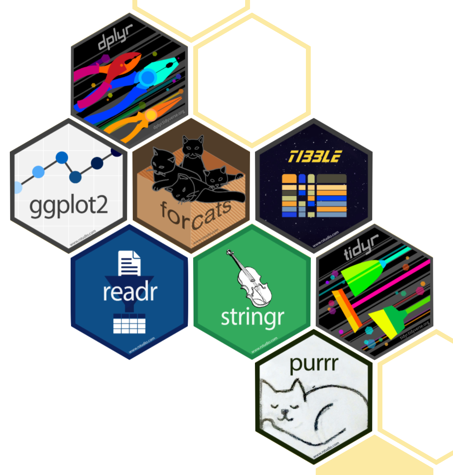

# Toolkit
.pull-left[Course Operation
- math4180.netlify.app
- Zoom
- Slack
- Canvas]

--

.pull-right[Programming
- R 
- RStudio
- tidyverse
- R Markdown]

--

.pull-right[Version control and collaboration
- Git
- Github]

---
class: inverse, center, middle

# Programming

---

# Learning Goals

By the end of the course, you will be able to:
- perform data visualization, data cleaning, data augmentation and data organization

- gain insight from data, reproducibly (with literate programming and version control) and collaboratively, using modern programming tools and techniques

---
class: inverse, center, middle

#Reproducible data analysis

---
# Reproducibility checklist

**What does it take for a data analysis to be "reproducible"?**

--

Short-term goals:
- Are the tables and figures reproducible from the code and data?

- Does the code actually do what you think it does?

- In addition to what was done, is it clear why it was done?

--


Long-term goals:
- Can the code be used for other data?

- Can you extend the code to do other things?

---
#Toolkit for reproducibility


- Scripting &rightarrow;**R**

- Literate programming &rightarrow;   **R Markdown**

- Version control &rightarrow; **Git/Github**

???

Notes here:
---
class: inverse, middle, center
#R and RStudio
---
#R and RStudio
.pull-left[
- R is an open-source statistical **programming language**

- R is also and environment for statistical computing and graphics

- It is extendable to suit your needs by installing *packages*
]

--

.pull-right[
- RStudio is a convenient interface for R called an **IDE** (integrated development environment) e.g. *"I write code in the RStudio IDE"*

- RStudio is not a requirement for programming with R, but it's very commonly used by R programmers and data scientists
]
---
#R packages
- **Packages** are the fundamental units of reproducible R code. They include reusable R functions, the documentation that describes how to use them, and sample data

- As of January 2021, there are over 16,000 R packages available on CRAN (the Comprehensive R Archive Network)

- We're going to work with a small (but important) subset of these!
---
# Tour: R and RStudio

```{r, echo=FALSE}
knitr::include_graphics("rstudio_tour.png") 
```

---
#A short list of R essentials

- Packages are installed with the **install.packages** function loaded with the **library** function, once per session:

```{r, eval=FALSE}
install.packages("tidyverse")
library(tidyverse)
```

--
- Columns (also called variables) in data frames are accessed with **$**:
```{r eval=FALSE}
iris$Sepal.Length
```
--
- Object documentation (how to ask RStudio for help) can be accessed with **?**:
```{r, eval=FALSE}
?plot
```

---
#A short list of R essentials
- The object assignment operator is denoted by **<-**
```{r, eval=FALSE}
birth_year <- 1941
```

||Windows|Mac|
|----|----|---|--|
|Shortcut| **Alt** + **-** | **Option** + **-**| 

--
You can also use **=** in a pinch

```{r}
birth_year = 1941
```

--
- R is case-sensitive
```{r, eval=FALSE}
my_age <- 2020 - birth_year
My_age
```

The code outputs an error
---
#A short list of R essentials

- Functions are (most often) verbs, followed by what they will be applied to in parentheses:

```{r, eval=FALSE}
do(something)
```

--

**do** is a function;

**something** is the argument of the function.

--

```{r, eval=FALSE}
do(something, wicked)
```

--

**do** is a function;

**something** is the first argument of the function;

**wicked** is the second argument of the function.

---
#A short list of R essentials

- Functions are (most often) verbs, followed by what they will be applied to in parentheses:


```{r}
head(iris)
```


---
#A short list of R essentials

- Functions are (most often) verbs, followed by what they will be applied to in parentheses:

```{r, out.height=300}

plot(iris$Sepal.Length,iris$Sepal.Width)

```

---
#tidyverse

.pull-left[
```{r, echo=FALSE}
 
```
]

.pull-right[
[tidyverse.org](https://www.tidyverse.org/)
- The **tidyverse** is an opinionated collection of R packages designed for data science

- All packages share an underlying philosophy and a common grammar
]
---
#tidyverse_style_guide
.pull-left[
canyoureadthissentence?

WhatAboutThisOne?

orThisOne? 

how_about_this_one?
]

--

.pull-left[
**Variable naming conventions**

- Pascalcase *VariableOne *

- Camelcase *variableOne*

- Snakecase *variable_one*
]

---
#tidyverse_style_guide
** Readable code **

- After function names do not leave any spaces.

- Before and after operators (e.g. <-, =) leave spaces.

- Put a space after a comma, not before.

- Object names are written in snakecase and are useful descriptors of the data it is holding

- Use whitespace (spaces, newlines) liberally, i.e. do not *crunch* your code

- Add commentary as the narrative or within large coding chunks to separate action

---
#What went wrong? What went right?

Chunk 1
```{r, eval=FALSE}
plot (iris)
```
Chunk 2
```{r}
myvar <- 3
myvar = 4 + myvar
```
Chunk 3
```{r}
smalllist <- c (1,2,3)
small_list<-c("A" ,"B" ,"C")
```


*Using the previous slide, try to fix each chunk before going to the next slide*

---
#What went wrong? What went right?

Chunk 1: Delete extra space after **plot** function.
```{r, eval=FALSE}
plot(iris)        
```

--

Chunk 2: Rename temporary variables as **x** or **y** if numeric value, **a** or **b** for categorical, or **temp_list** if a list. If you plan to use **x=3** multiple times, the second command should be a new variable rather than overwriting an existing variable. Overwriting may be the preferred method in some instances - we will cover this in upcoming lectures.

```{r}
x <- 3           
y = 4 + x         
```

--

Chunk 3: Convert variables to snakecase. Delete spacing after function call.. here **c** is a function that creates a list. You will see this function pop up as the semester continues. Add spacing before and after assignment operator, and after commas rather than before.

```{r}
small_list <- c(1,2,3)  
                        
small_list <- c("A", "B", "C") 
```

---
#rmarkdown
[rmarkdown.rstudio.com](rmarkdown.rstudio.com)
- **rmarkdown** and the various packages that support it enable R users to write their code and prose in reproducible computational documents

- We will generally refer to R Markdown documents (with **.Rmd** extension), e.g. "*Do this in your R Markdown document"* and rarely discuss loading the rmarkdown package

---
class: inverse, center, middle
#R Markdown
---
#R Markdown

- Fully reproducible reports &rightarrow; each time you knit the analysis is run from the beginning

- Simple markdown syntax for text

- Code goes in chunks, defined by three backticks, narrative goes outside of chunks
---
#Tour: R Markdown
```{r, echo=FALSE}
knitr::include_graphics("rmarkdown_tour.png") 
```

---
#Environments

**The environment of your R Markdown document is separate from the Console!**

Remember this, and expect it to bite you a few times as you're learning to work with R Markdown!

--

First, run the following in the console

```{r, eval=FALSE}
x<-2
x * 3
```
--

Then, add the following in an R chunk in your R Markdown document

```{r, eval=FALSE}
x*3
```

--

What happens? Why the error?

---
#R Markdown help

- R Markdown Cheatsheets

    **Help &rightarrow; Cheatsheets**
    
- Mardown Quick Reference

    **Help &rightarrow; Markdown Quick Reference**
    
- When in doubt, Google it out
    
    
